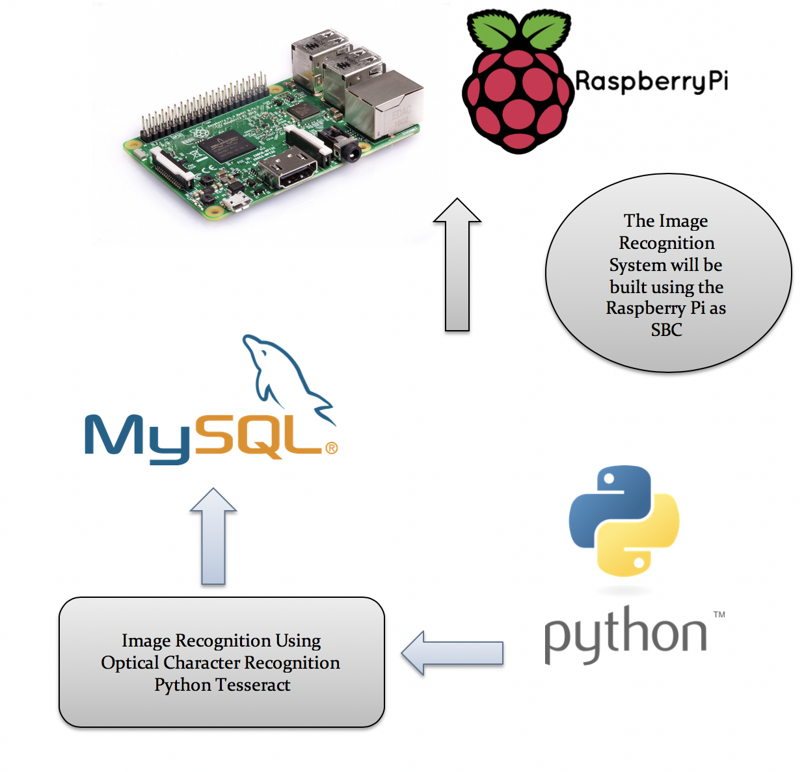
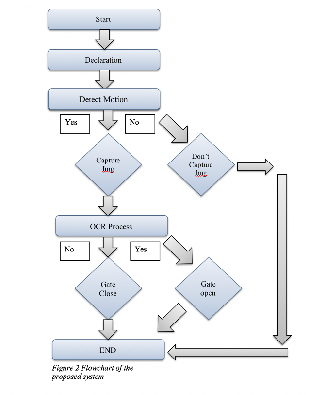
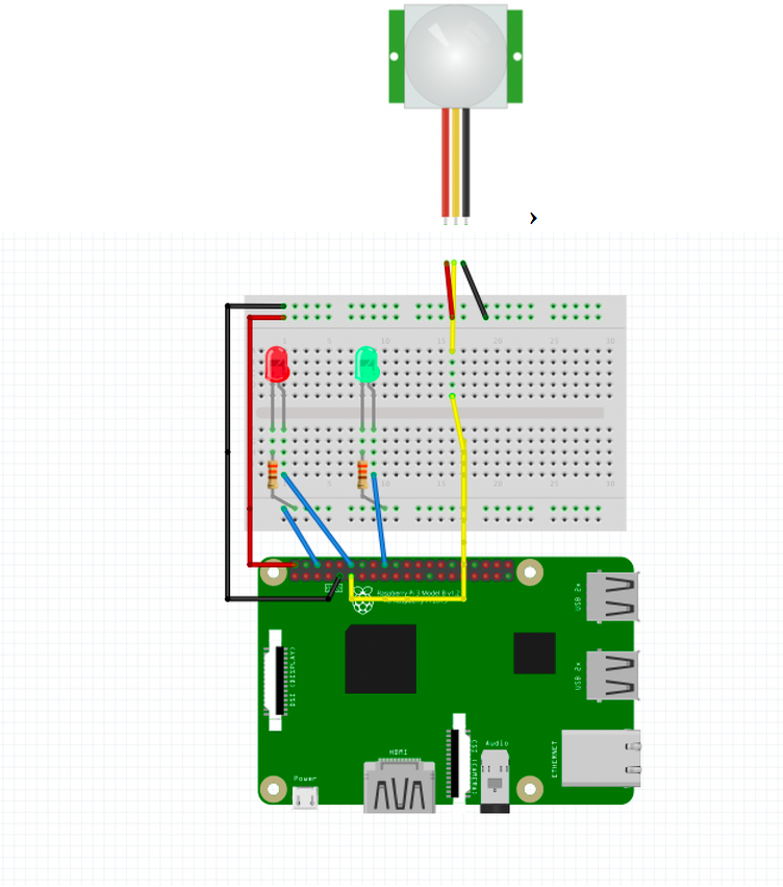
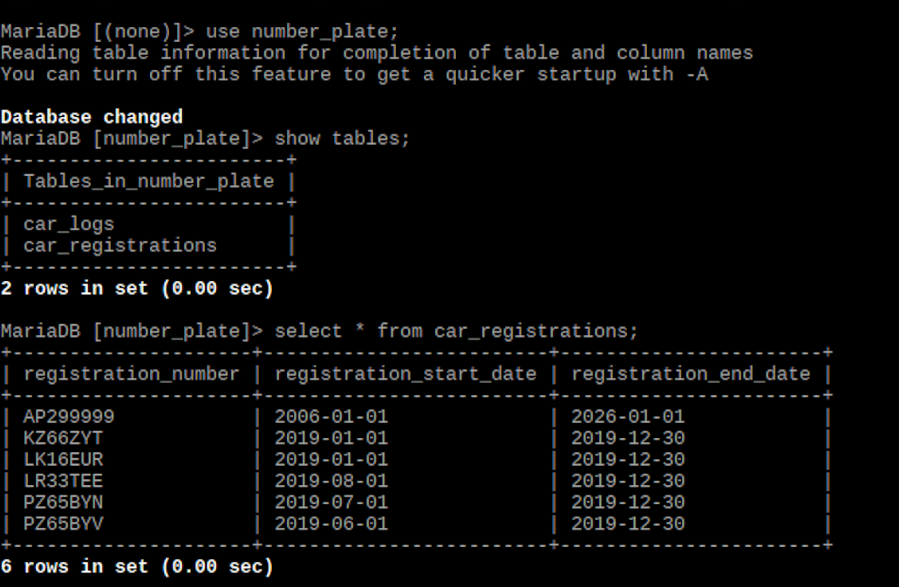
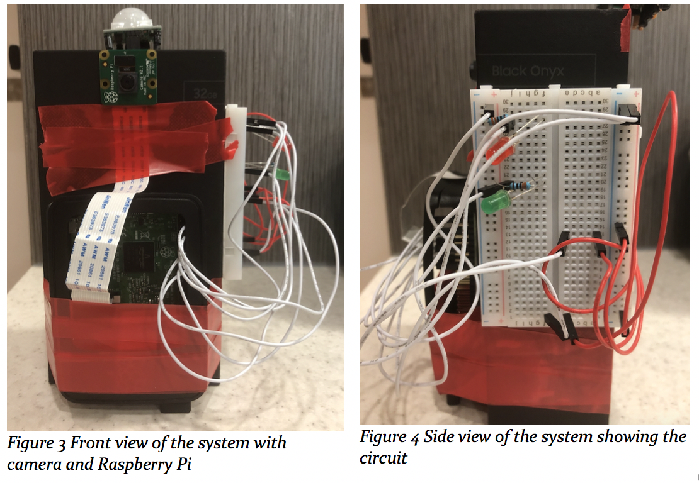
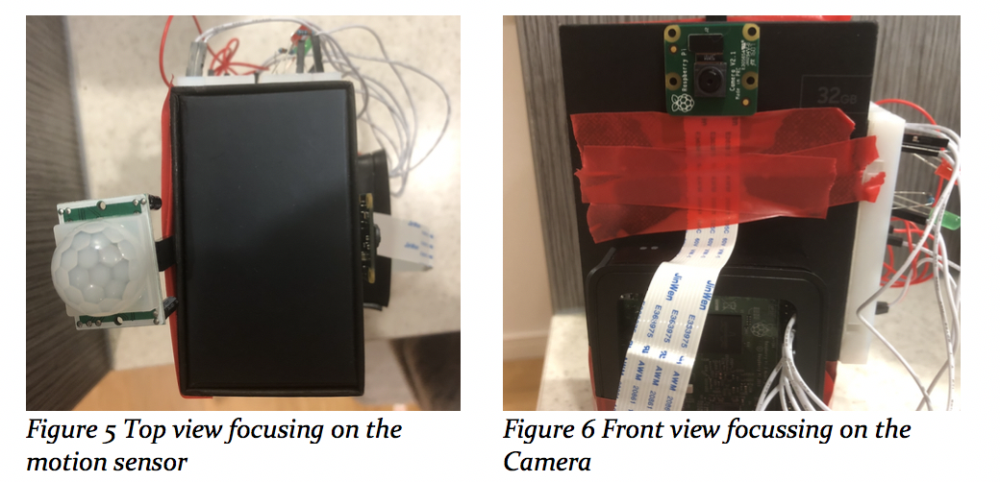
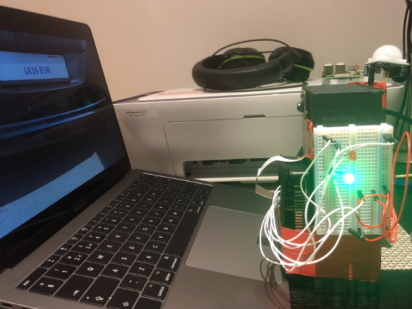

# Image-Recognition-Using-Raspberry-Pi
Number Plate Recognition System. With the easy accessibility of single board computers and the rise of ease of use of Image Recognition APIs, we are now able to create highly complex systems using low computational devices. In this project, I will be creating a number plate recognition system using a Raspberry Pi and various sensors.

This project will be a simple display of how we can conduct image recognition using a small board computer, Raspberry Pi. The motion sensor, LEDs and a Raspberry Pi camera will be used in this project. Some pictures are included to give an idea of how the Image Recognition System looks like.

## Table of Contents
* [Hardware](#Hardware)
* [Layout](#Layout)
* [Setup](#LocalSetup)
* [Pictures](#Pictures)
* [ToDo](#ToDo)

## Hardware

1. Raspberry Pi (Personally I have used the Raspberry Pi 3 but can use the latest version)
2. Pi Camera
3. PIR motion sensor
4. LEDs
5. Breadboard, jumper cables

## Layout

1. Basic Design

2. Flow chart of how the system works

3. Schematic Layout
An idea of how to build the circuit

In the above picture, the circuit connections between components i.e LEDs and motion sensor. Camera is fitted in the Raspberry Pi Camera Port.

## Setup

1. Install MySql.
2. Build a database where the car logs can be stored and the registration details are saved.

3. Now we move on to python coding.

4. mpr.py 

The main objective of this is to detect motion, capture an image once the motion is detected and crop the image according to the requirements of the character recognition and translate the image into string and store it in a variable

5. The 'entry' and 'exit' commands call two different programs depending on if a car is entering of exiting the premise. 

## Pictures

## ToDo

* Tests with different number plate images

